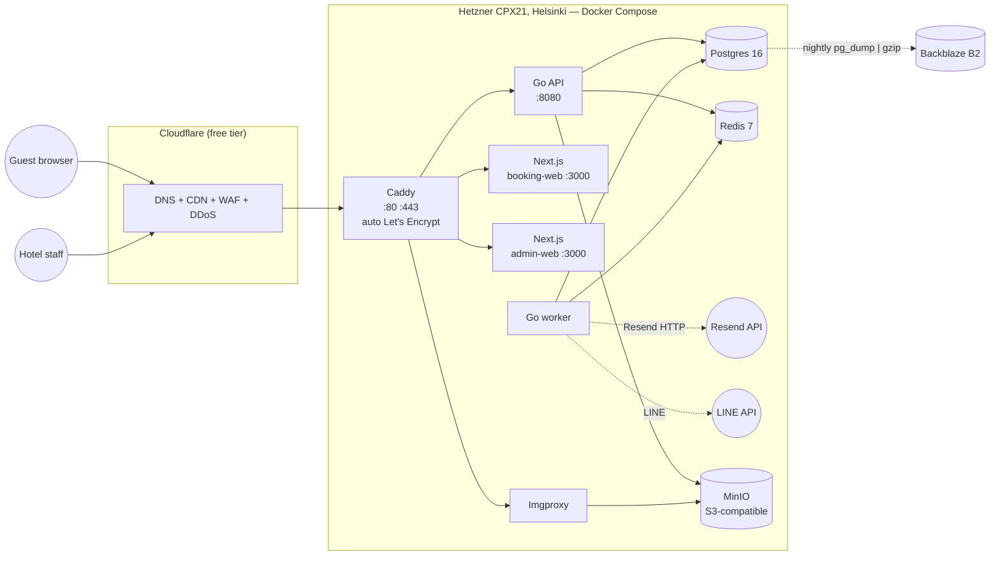
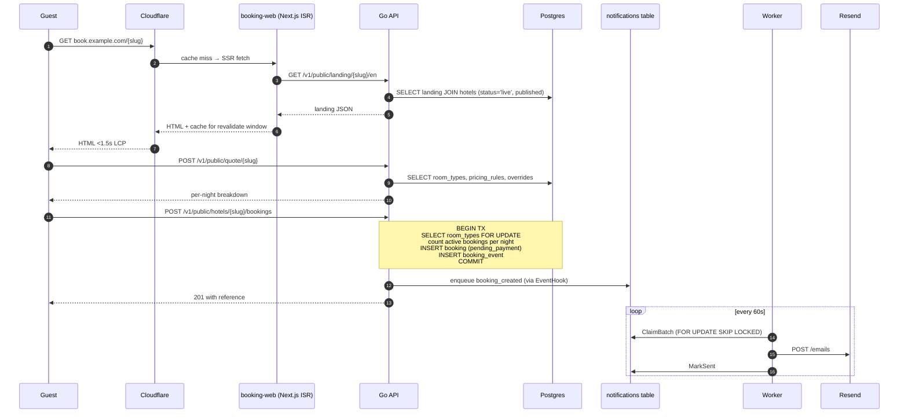
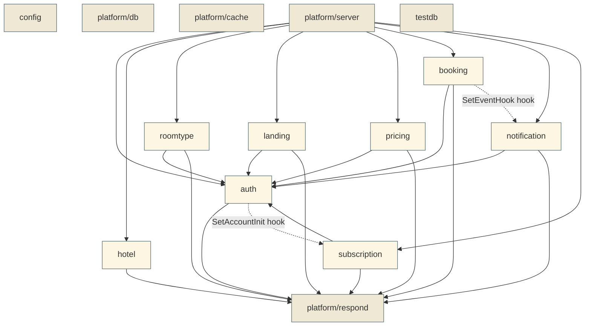
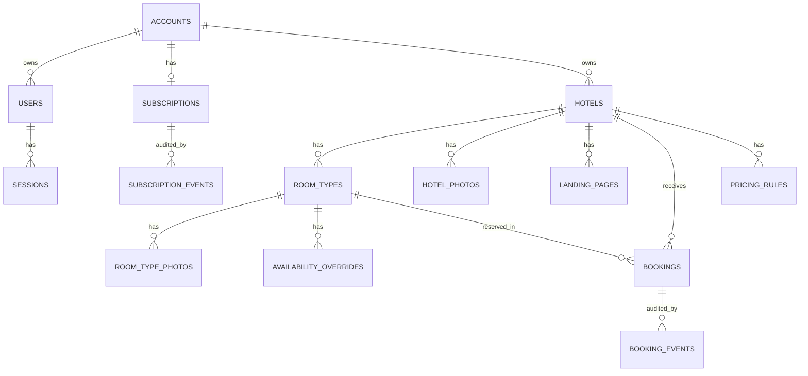

# Architecture

System-level view of the hotel-booking SaaS. For specific decisions see [`decisions/`](decisions/); for module internals see each package's `doc.go`.

---

## 1. Deployment topology

**Key invariants:**

- Only Caddy binds host ports (80/443). Postgres, Redis, MinIO are not reachable from the public internet — they live on the internal `hotel_net` Docker network.
- Guests never connect directly to the API; their browser fetches the booking-web static HTML from CDN, then makes XHR to `api.<domain>` (also CDN-proxied).
- Money flows **direct from guest to hotel** — we are not a payment facilitator. Our own billing for hotel subscriptions goes through Stripe/Omise (Phase 2).

---

## 2. Request flow — guest booking

See [ADR-0007](decisions/0007-select-for-update-booking-race.md) for the race-condition guarantee and [ADR-0008](decisions/0008-outbox-pattern-notifications.md) for the outbox pattern.

---

## 3. Module dependency graph

**Dependency rules:**

1. **`platform/*` may not import any domain package.**
2. **Domain packages may import `auth` (for `Identity`, `RequireAuth`) and `platform/respond` — nothing else from other domains at the package level.**
3. **Cross-domain effects (e.g. booking → notification) go through hooks set at wiring time** in `platform/server/server.go`. This is what makes adding a new domain to a side-effect chain a one-line server-config change, not a refactor.
4. **`testdb` is for tests only.** Import only from `_test.go` files.

---

## 4. Data model overview

**Tenancy:** every queryable row chains to an `accounts.id`. Repositories filter by `account_id` from `auth.IdentityFrom(ctx)`. Cross-tenant access returns 404, never 403 (no existence disclosure).

**Money columns:** `*_cents BIGINT` for stored totals; `NUMERIC(10,2)` for user-edited rates that round-trip to the admin UI as decimals.

**Audit tables:** `booking_events`, `subscription_events`, `notifications` are append-only. They double as the source of truth for replay-style queries and as the trigger surface for the outbox pattern.

---

## 5. Where to put things

| Adding… | Goes in |
|---|---|
| New domain | `apps/api/internal/<name>/` (6-file pattern: errors, types, repository, service, handler, doc) + migration + wire into `platform/server/server.go` |
| New endpoint on existing domain | `<domain>/handler.go` + matching service method |
| New column | `migrations/00NN_*.{up,down}.sql` + repository scanColumns + `_test.go` |
| New side effect on a booking event | `bookingHook` closure in `platform/server/server.go` |
| New worker job | `cmd/worker/main.go` `runJobs` — keep it idempotent + bounded |
| New ADR | `docs/decisions/00NN-*.md`, status="Proposed" until merged |
| New runbook | `docs/runbooks/NN-*.md` |
| New env var | `internal/config/config.go` + `.env.example` + (if non-default) `AGENTS.md` "Gotchas" |
| New dependency | Discussed in PR + ADR justifying it |

---

## 6. Non-goals

These are stated to prevent re-litigating:

- **Search across hotels.** We don't index multiple hotels for guest discovery — [ADR-0002](decisions/0002-direct-booking-not-marketplace.md).
- **Commission billing.** Money flows direct to hotels — [ADR-0001](decisions/0001-subscription-not-commission.md).
- **Payment escrow.** We're not a payment facilitator.
- **Custom CSS / HTML / JS in landing pages.** Structured template only — [ADR-0009](decisions/0009-structured-template-not-page-builder.md).
- **Mobile native apps.** Mobile web only Phase 1-2.
- **Booking.com-style ranking algorithm.**
- **Float for money.** Anywhere. Use `int64` minor units — [ADR-0006](decisions/0006-money-as-int64-minor-units.md).
