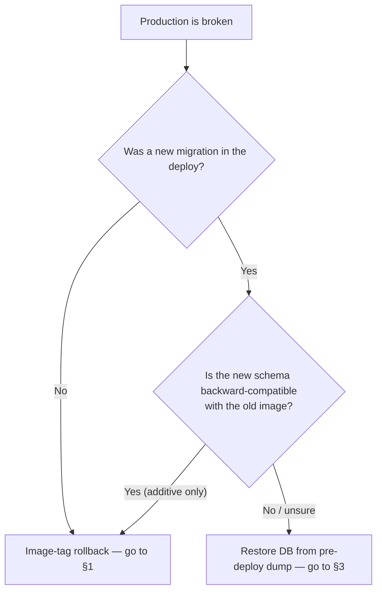

# 02 — Rollback a bad deploy

**When to use:** the last deploy broke production. API 500-ing, web app not rendering, or a regression that customer support is escalating.
**Time estimate:** 5 minutes for image-tag rollback. Add 5-15 min if a migration needs reverting.
**Risk level:** Medium — image rollback is safe; reverting a migration over real user data is high-risk.

## Decision tree



## 1. Image-tag rollback (no schema involved)

```bash
ssh deploy@<server>
cd /opt/hotel-booking

# Find the previous good SHA — last entry in GHCR or the deploy workflow history.
gh run list --repo GA-MO/hotel-booking --workflow Deploy --limit 5

# Set IMAGE_TAG to the prior SHA (e.g. abc1234) and roll.
PREV=abc1234
IMAGE_TAG=$PREV docker compose -f docker-compose.prod.yml --env-file .env.prod pull
IMAGE_TAG=$PREV docker compose -f docker-compose.prod.yml --env-file .env.prod up -d --remove-orphans

# Verify.
curl -sSfI https://api.${DOMAIN}/healthz
docker compose -f docker-compose.prod.yml logs --tail=50 api worker
```

After verifying, **also revert the `:latest` tag** to point at PREV so the next casual `pull` doesn't re-pick the bad build. Either re-tag in GHCR or trigger the deploy workflow on the prior commit.

## 2. If the bad deploy added an additive migration only

A schema that only adds columns / tables (no drops, no constraint tightening) is backward-compatible. The previous-version code will ignore the new columns and keep working. Apply §1 — no DB action needed.

## 3. If the bad deploy added a destructive migration

Destructive = `DROP COLUMN`, `ALTER COLUMN ... NOT NULL` on existing data, `DROP TABLE`, type narrowing.

```bash
# 1. Stop accepting new writes from API + worker.
docker compose -f docker-compose.prod.yml stop api worker

# 2. Restore Postgres from the *pre-deploy* dump (taken automatically by the worker
#    or manually right before the deploy, per infra/README.md §6).
#    `infra/README.md` §5.2 has the backup-restore procedure (drop DB, pg_restore from B2 dump).

# 3. With the old schema back, roll the image to PREV (per §1).

# 4. Bring api + worker back up.
docker compose -f docker-compose.prod.yml --env-file .env.prod up -d api worker
```

## 4. Post-rollback

- [ ] Smoke test `scripts/smoke-test.sh` against production (set `API_URL=https://api.${DOMAIN}`).
- [ ] File an incident note in `docs/runbooks/incidents/YYYY-MM-DD-short-title.md`.
- [ ] Open a follow-up PR that reverts the bad change on `main` and includes a regression test.
- [ ] If the bug reached real users, send a status-update email via Resend + a LINE OA broadcast.

## Prevention

- **Always take a pre-deploy dump for schema-changing releases** — see `infra/README.md` §6 last block.
- **Tag commits with `[skip deploy]`** if they include a risky migration; deploy manually after a manual verification on staging.
- Migrations that drop / narrow MUST land in a multi-step release: add new column → deploy → backfill → deploy → drop old column.
